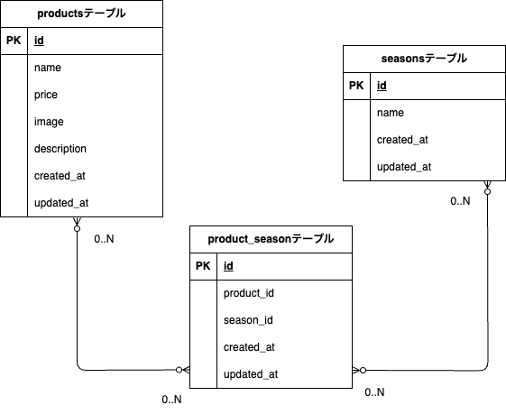

# もぎたてフリマ（商品管理アプリ）

## 概要
商品を登録・編集・削除・検索できるフリマサイト風の Web アプリケーションです。
商品には複数の季節（季節タグ）を紐付けでき、商品一覧から季節や価格で絞り込み検索が可能です。
## セットアップ手順
### 1. リポジトリのクローン
```bash
- git clone git@github.com:yurinaniko/mogitate-flea-market.git
- cd mogitate-flea-market
```
### 2. Docker 起動
```
- docker compose up -d --build
- docker compose exec php bash
```
### 3. Composer インストール
```
- composer install
```
### 4. .env ファイル作成
```
- cp .env.example .env
```
### 5. .env 設定
以下の内容を `.env.example` に合わせて `.env` を作成してください。
```dotenv
- APP_NAME=laravel
- APP_ENV=local
- APP_KEY=
- APP_DEBUG=true
- APP_URL=http://localhost

- DB_CONNECTION=mysql
- DB_HOST=mysql
- DB_PORT=3306
- DB_DATABASE=laravel_db
- DB_USERNAME=laravel_user
- DB_PASSWORD=laravel_pass
```
### 6. アプリケーションキー生成
```bash
- php artisan key:generate
```
### 7. データベース設定 & マイグレーション + シーディング
```
- php artisan migrate --seed
```
### 8. アプリケーション確認
```
- http://localhost:8000
```
###　　備考 M1 / M2 Mac を使用している場合
Dockerビルド時に以下のエラーが発生することがあります：
```
no matching manifest for linux/arm64/v8 in the manifest list entries
```
その場合は `docker-compose.yml` の `mysql` サービス内に `platform` を追記してください。

```
yaml
mysql:
  platform: linux/x86_64
  image: mysql:8.0
  container_name: mysql
  environment:
    MYSQL_ROOT_PASSWORD: root
    MYSQL_DATABASE: laravel_db
    MYSQL_USER: laravel_user
    MYSQL_PASSWORD: laravel_pass
```

## 使用技術
```
| 種類                    | バージョン |
| ----------------------- | ---------- |
| PHP                     | 8.1        |
| Laravel                 | 10.x       |
| MySQL                   | 8.0        |
| Docker / docker-compose | 最新       |
| Nginx                   | 1.25       |
| Blade / BEM CSS         | UI 実装    |
```
## 機能一覧

- 商品一覧表示
- 商品詳細
- 商品登録（画像アップロード / バリデーション / 季節の複数選択）
- 商品編集（画像差し替え / 画像削除）
- 商品削除
- 商品検索（キーワード / 価格順 / 季節）
- ページネーション

## 画面一覧

```
| 画面 | method | path |
|------|--------|------|
| 商品一覧 | GET | /products |
| 商品詳細 | GET | /products/{id} |
| 商品登録 | GET | /products/create |
| 登録実行 | POST | /products |
| 商品編集 | GET | /products/{id}/edit |
| 編集更新 | PUT | /products/{id} |
| 削除 | DELETE | /products/{id} |
| 検索 | GET | /products?keyword= |
```

### ER 図



