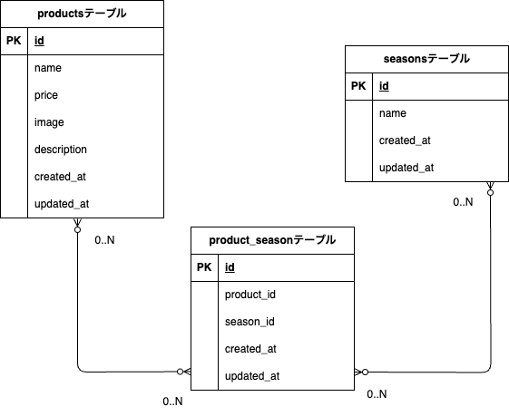

# もぎたてフリマ（商品管理アプリ）

## 概要
```
商品を登録・編集・削除・検索できるフリマサイト風の Web アプリケーションです。
商品には複数の季節（季節タグ）を紐付けでき、商品一覧ではキーワード検索と価格の並び替えができます。
```
## セットアップ手順
### 1. リポジトリのクローン
```bash
git clone git@github.com:yurinaniko/mogitate-flea-market.git
cd mogitate-flea-market
```

### 2. Docker 起動

```
docker compose up -d --build
docker compose exec php bash
```

### 3. .env ファイル作成

```
cp .env.example .env
```

### 4. Composer 必要パッケージインストール

```
composer install
```

※ CSSは public/css/ の静的ファイルのため、npm によるビルドは不要です。

### 5. .env 設定

```dotenv
APP_NAME=Laravel
APP_ENV=local
APP_KEY=
APP_DEBUG=true
APP_URL=http://localhost:8002

DB_CONNECTION=mysql
DB_HOST=mysql
DB_PORT=3306
DB_DATABASE=laravel_db
DB_USERNAME=laravel_user
DB_PASSWORD=laravel_pass
```

### 6. アプリケーションキー生成

```bash
php artisan key:generate
```

### 7. データベース設定 & マイグレーション + シーディング

```
php artisan migrate --seed
```
### 8. 画像参照用シンボリックリンク作成
```
php artisan storage:link
```

### 9. アプリケーション確認

```
アプリ:        http://localhost:8002
phpMyAdmin:   http://localhost:8083（DB確認用）
```
※ MySQL はホスト側 3309 番で公開しています（GUIツールから接続する場合）。

### 10. テストの実行

```
# テスト用DBを作成（初回のみ・コンテナの外から）
docker compose exec mysql mysql -uroot -proot -e "CREATE DATABASE IF NOT EXISTS laravel_test;"
# 実行（PHPコンテナ内で）
php artisan test
```

Feature テスト20件（バリデーションの境界値・シーディングの再現性）。
CI（GitHub Actions）でもプッシュごとにテストと composer audit --locked による
依存脆弱性監査を実行しています。

### 備考 Apple Silicon (M1/M2) Mac について

```
docker-compose.yml で全サービスに platform: linux/arm64/v8 と
arm64v8系イメージを指定済みのため、追加の設定なしで動作します。
```

## 使用技術

```
| 種類                     | バージョン  |
| ----------------------- | ---------- |
| PHP                     | 8.3        |
| Laravel                 | 12.x（8で構築後、8→9→10→11→12へ段階アップグレード済み） |
| MySQL                   | 8.0        |
| Docker / docker-compose | 最新        |
| Nginx                   | 1.25       |
| Blade / BEM CSS         | UI 実装     |

```

## 機能一覧
```
・商品一覧表示
- 商品検索機能（キーワード部分一致）
- 価格順並び替え機能（安い順 / 高い順）
- ページネーション

・商品編集（画像の差し替え）
・商品削除

・商品登録（画像アップロード / バリデーション / 季節の複数選択）

```
## 画面一覧

```
| 画面       | HTTP method | path                   　　　　　　　　　　　　 |
|-----------|-------------|---------------------------------------------|　　　　　　　
| 商品一覧   | GET         | /products                                   |
| 商品登録   | GET         | /products/create                            |
| 登録実行   | POST        | /products                                   |
| 商品編集   | GET         | /products/{id}/edit                         |
| 編集更新   | PUT         | /products/{id}                              |
| 削除      | DELETE      | /products/{id}                              |
| 検索      | GET         | /products?keyword={keyword}&sort={sort}     |

```

### ER 図



### テーブル仕様書
```
- productsテーブル（商品）
| カラム名      | 型              | NULL     | 初期値             | 備考                    |
|-------------|-----------------|----------|-------------------|-------------------------|
| id          | BIGINT          | NOT NULL | auto_increment    | 主キー                   |
| name        | VARCHAR(255)    | NOT NULL | —                 | 商品名                   |
| price       | INT             | NOT NULL | —                 | 0〜10000 バリデーション    |
| description | TEXT            | NOT NULL | —                 | 商品説明（バリデーションで120文字以内） |
| image       | VARCHAR(255)    | NOT NULL | —                 | 商品画像ファイル名          |
| created_at  | TIMESTAMP       | —        | CURRENT_TIMESTAMP | 作成日時                  |
| updated_at  | TIMESTAMP       | —        | CURRENT_TIMESTAMP | 更新日時                  |
```
```
- seasonsテーブル（季節）
| カラム名     | 型           | NULL      | 初期値              | 備考              |
|-------------|-------------|-----------|--------------------|-------------------|
| id          | BIGINT      | NOT NULL  | auto_increment     | 主キー             |
| name        | VARCHAR(50) | NOT NULL  |                    | 春 / 夏 / 秋 / 冬  |
| created_at  | TIMESTAMP   |           | CURRENT_TIMESTAMP  | 作成日時           |
| updated_at  | TIMESTAMP   |           | CURRENT_TIMESTAMP  | 更新日時           |
```
```
- product_seasonテーブル（中間テーブル）
| カラム名      | 型        | NULL     | 備考                         |
|-------------|-----------|----------|------------------------------|
| id          | BIGINT    | NOT NULL | auto_increment / 主キー       |
| product_id  | BIGINT    | NOT NULL | 外部キー → products.id        |
| season_id   | BIGINT    | NOT NULL | 外部キー → seasons.id         |
| created_at  | TIMESTAMP |          |                              |
| updated_at  | TIMESTAMP |          |                              |
```
```
- リレーション
| モデル    | 関係            | モデル    |
|----------|----------------|----------|
| Product  | belongsToMany  | Season   |
| Season   | belongsToMany  | Product  |
商品（Product）と季節（Season）は多対多（N:N）関係であり、
中間テーブル `product_season` を用いて関連付けを行っています。
```
## 動作確認URL
```
http://localhost:8002
```
### 実装した応用機能
```
- 商品画像は storage/app/public に保存し、`php artisan storage:link` によるシンボリックリンクで公開
- 商品の季節は複数選択可能（belongsToMany / 中間テーブル product_season）
- 編集画面では、season の入力保持を実現（初回は product 値、バリデーションエラー時は old 優先）
- 商品検索と価格並び替え機能を同時に適用可能（クエリパラメータ保持による state 維持）
- 削除確認モーダルを実装（画像の差し替え / 商品削除 / キャンセル切替）
- シード画像は database/seeders/images でGit管理し、シーディング時にstorageへコピー（クローン直後でも画像が表示される）
```
### 備考
```
・検索フォームは丸型デザインとし、フォームUIとの差別化を行うことで視認性を向上
・入力フォームは共通コンポーネント（.form-input）として管理し、登録・編集画面間で統一感を持たせた
```